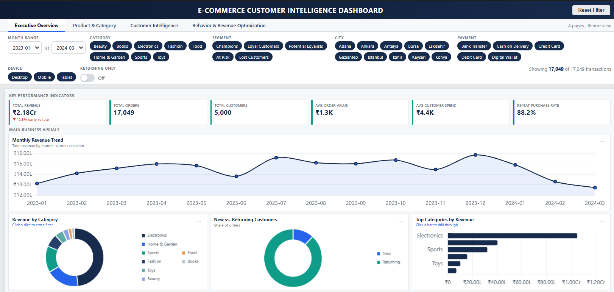
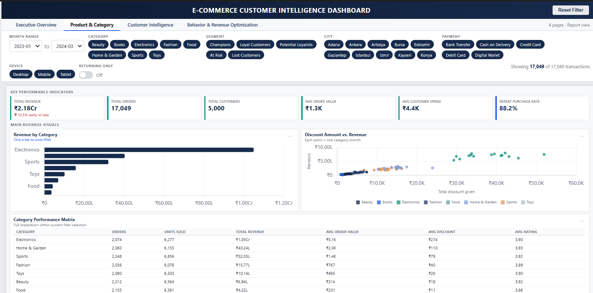
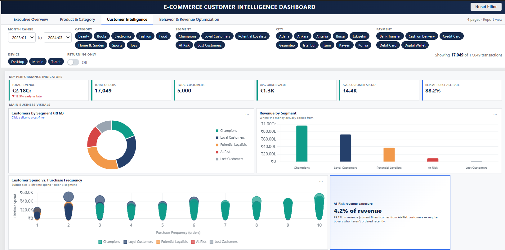
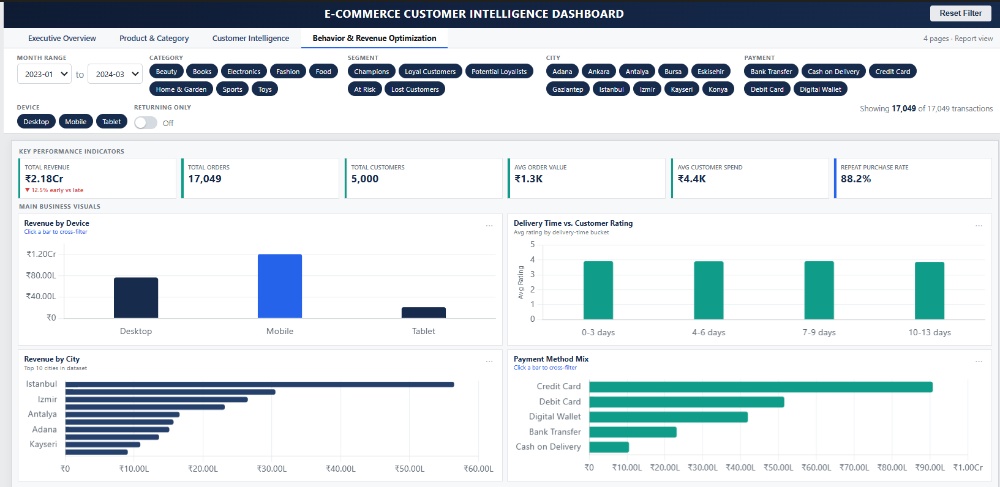

# E-Commerce Customer Intelligence & Revenue Optimization

## 📌 Project Overview

An end-to-end data analytics project designed to analyze e-commerce sales performance, customer purchasing behavior, customer value, product/category performance, and revenue opportunities.

The project transforms transactional e-commerce data into actionable business insights using **Python, MySQL, and Power BI**.

The analysis focuses on helping business teams understand:

* Revenue and sales performance
* Customer purchasing behavior
* New vs returning customers
* RFM-based customer segmentation
* At-risk customer revenue exposure
* Product/category performance
* Payment and device behavior
* Regional sales performance
* Delivery experience and customer ratings

---

## 🎯 Business Problem

E-commerce businesses generate large volumes of customer and transaction data, but raw transaction records do not directly explain:

* Which categories generate the most revenue?
* Which customers contribute the most value?
* Which customers are at risk of becoming inactive?
* How does purchasing frequency relate to customer spending?
* Which cities and devices contribute most to revenue?
* Which payment methods are most commonly used?
* How do delivery times relate to customer ratings?
* How does revenue change over time?

This project addresses these questions through data cleaning, exploratory analysis, customer segmentation, SQL analysis, and an interactive Power BI dashboard.

---

## 🎯 Project Objectives

1. Analyze overall e-commerce revenue and transaction performance.
2. Identify high-performing product categories.
3. Understand customer purchasing behavior.
4. Segment customers using RFM analysis.
5. Identify at-risk customers and revenue exposure.
6. Analyze new vs returning customer behavior.
7. Evaluate payment method and device performance.
8. Analyze city-level revenue performance.
9. Study delivery time and customer rating patterns.
10. Build an interactive Power BI dashboard for business decision-making.

---

## 🛠️ Tools & Technologies

| Tool       | Purpose                                             |
| ---------- | --------------------------------------------------- |
| Python     | Data cleaning, transformation and customer analysis |
| Pandas     | Data manipulation and aggregation                   |
| NumPy      | Numerical analysis                                  |
| MySQL      | Business-focused SQL analysis                       |
| Power BI   | Interactive dashboard and visualization             |
| DAX        | KPI and analytical measures                         |
| Git/GitHub | Version control and project documentation           |

---

## 📂 Dataset

The project uses an e-commerce customer behavior and sales dataset containing transactional, customer, product, payment, device, delivery and rating information.

### Key fields include:

* Customer ID
* Order ID
* Date
* Age
* Gender
* City
* Product Category
* Unit Price
* Quantity
* Discount Amount
* Total Amount
* Payment Method
* Device Type
* Session Duration
* Pages Viewed
* Returning Customer Indicator
* Delivery Time
* Customer Rating

---

# 🔄 Project Workflow

```text
Raw Dataset
     ↓
Data Understanding
     ↓
Data Cleaning
     ↓
Exploratory Data Analysis
     ↓
Customer Behavior Analysis
     ↓
RFM Segmentation
     ↓
Cohort / Retention Analysis
     ↓
MySQL Business Analysis
     ↓
Power BI Data Modeling
     ↓
DAX Measures
     ↓
Interactive Dashboard
     ↓
Business Insights & Recommendations
```

---

# 🐍 Python Analysis

Python was used for:

* Dataset inspection
* Data type validation
* Missing-value analysis
* Duplicate detection
* Date transformation
* Monthly sales preparation
* Customer-level aggregation
* RFM analysis
* Customer segmentation
* At-risk customer identification
* Cohort preparation
* Retention analysis

### Key Python techniques

* Pandas
* NumPy
* GroupBy
* Aggregation
* Datetime transformation
* Conditional segmentation
* Customer-level analysis

---

# 👥 RFM Customer Segmentation

RFM analysis was used to evaluate customers based on:

### Recency

How recently a customer made a purchase.

### Frequency

How frequently a customer purchased.

### Monetary

How much revenue the customer generated.

Customers were classified into segments such as:

* Champions
* Loyal Customers
* Potential Loyalists
* At Risk
* Lost Customers

This segmentation helps identify customers who can be targeted through retention and engagement strategies.

---

# 📊 SQL Analysis

MySQL was used to perform business-oriented analysis including:

* Overall revenue KPIs
* Customer-level sales
* Category performance
* Monthly revenue
* Payment method analysis
* Top customers
* Revenue contribution
* Customer ranking
* Window functions
* CTE-based analysis

---

# 📈 Power BI Dashboard

The Power BI report contains four analytical pages.

## 1. Executive Overview

Provides a high-level view of:

* Total Revenue
* Total Orders
* Total Customers
* Average Order Value
* Average Customer Spend
* Repeat Purchase Rate
* Monthly Revenue Trend
* Revenue by Category
* New vs Returning Customers
* Top Categories

## 2. Product & Category

Focuses on:

* Revenue by Category
* Discount vs Revenue
* Category Performance Matrix
* Orders
* Units Sold
* Revenue
* Average Order Value
* Average Discount
* Average Rating

## 3. Customer Intelligence

Focuses on:

* RFM Customer Segmentation
* Revenue by Customer Segment
* Customer Spend vs Purchase Frequency
* At-Risk Revenue Exposure

## 4. Behavior & Revenue Optimization

Analyzes:

* Revenue by Device
* Delivery Time vs Customer Rating
* Revenue by City
* Payment Method Mix

---

# 📌 Key KPIs

The dashboard tracks:

* Total Revenue
* Total Orders
* Total Customers
* Average Order Value
* Average Customer Spend
* Repeat Purchase Rate

---

# 💡 Business Insights

The analysis enables management to identify:

* High-revenue product categories
* High-value customer segments
* Revenue contribution from different customer segments
* At-risk customer revenue exposure
* Differences in customer purchasing frequency
* Strong-performing cities
* Preferred payment methods
* Device-level revenue contribution
* Monthly revenue trends
* Potential retention opportunities

---

# 🎯 Business Recommendations

### 1. Customer Retention

Target At-Risk customers with personalized offers, reminders and re-engagement campaigns.

### 2. High-Value Customer Strategy

Provide loyalty benefits and personalized recommendations to Champions and Loyal Customers.

### 3. Category Optimization

Prioritize high-revenue categories while evaluating lower-performing categories for pricing and promotional improvements.

### 4. Revenue Optimization

Monitor discount levels against revenue performance to identify opportunities for more efficient promotions.

### 5. Customer Experience

Investigate delivery-time patterns associated with lower customer ratings.

### 6. Channel Optimization

Use device-level and payment-method insights to optimize the online purchasing experience.

---

# 📸 Dashboard Screenshots

### Executive Overview



### Product & Category



### Customer Intelligence



### Behavior & Revenue Optimization



---

# 📁 Project Structure

```text
E-Commerce-Customer-Intelligence-Revenue-Optimization/
│
├── data/
├── python/
├── sql/
├── powerbi/
├── screenshots/
├── reports/
├── README.md
└── requirements.txt
```

---

# 🚀 Future Scope

Potential extensions include:

* Customer lifetime value prediction
* Sales forecasting
* Product recommendation analysis
* Customer churn prediction
* Automated Power BI refresh
* Marketing campaign effectiveness analysis
* Advanced cohort retention analysis

---

# 👤 Skills Demonstrated

### Data Analytics

* Data Cleaning
* Exploratory Data Analysis
* Customer Analytics
* Revenue Analysis
* Cohort Analysis
* RFM Segmentation

### SQL

* Aggregations
* GROUP BY
* CTEs
* Window Functions
* Ranking
* Date Functions

### Power BI

* Dashboard Development
* Data Modeling
* DAX
* KPI Design
* Interactive Slicers
* Cross-filtering
* Business Visualization

---

## 📌 Project Outcome

This project demonstrates an end-to-end analytics workflow from raw transactional data to business-ready insights and an interactive Power BI dashboard.

The solution helps e-commerce stakeholders understand **revenue performance, customer value, purchasing behavior, retention opportunities and operational trends**.
